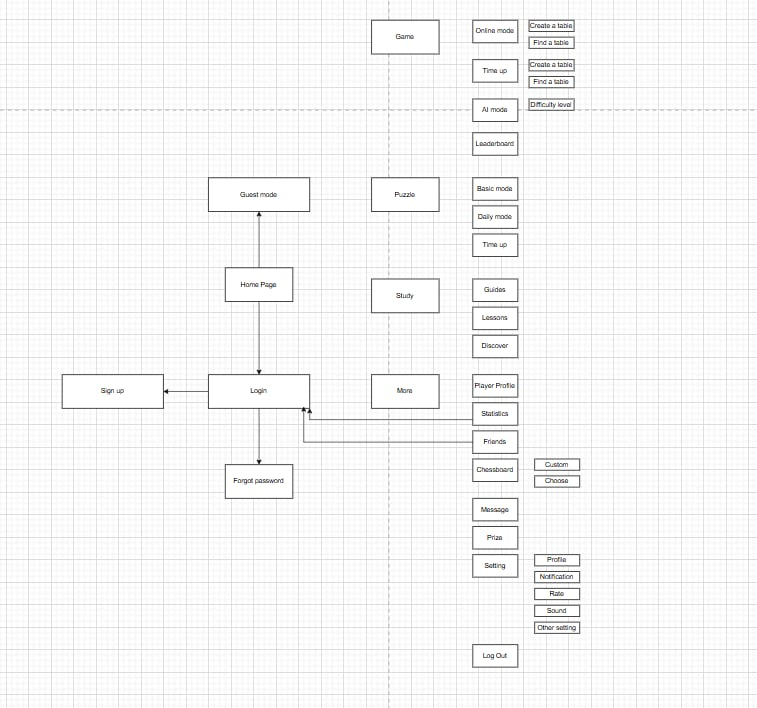

# Cờ Toán Việt Nam

Cờ Toán Việt Nam is the creative product of Mr. Vũ Văn Bảy (Vũ Bảy), an artisan sculptor (from a family of three generations of sculptors) in Suối Hoa, Vũ Ninh ward, Bắc Ninh city, Bắc Ninh province, Vietnam. Cờ Toán Việt Nam was officially recognized as an intellectual product by the Copyright Office of Literature and Art, Ministry of Culture - Information (now the Ministry of Culture, Sports and Tourism) in May 2005.

Cờ Toán Việt Nam is considered a recreational game with mathematical and social philosophy elements, distinct from popular games like Chinese Xiangqi and Western Chess. Players must use simple mathematical knowledge such as addition, subtraction, multiplication, and division to calculate their moves. In chess and Xiangqi, losing the king or general means losing the game. However, Cờ Toán Việt Nam differs in that the piece numbered 0 represents the people, not a king or general, and losing this piece results in an absolute loss. According to the author Vũ Bảy: "When playing Cờ Toán, it not only helps people calculate but also teaches them life lessons. Each person's character will be reflected through the game. If one only likes to add and multiply without end, they will fail."

## This is the screen diagram:

## This project is in development, using the following technologies:
- **Kotlin**
- **Clean Architecture**
- **MVVM**

## Contributing
Contributions are welcome! Please read the [CONTRIBUTING.md](CONTRIBUTING.md) for guidelines on how to contribute to this project.

## License
This project is licensed under the Apache License 2.0. See the [LICENSE](LICENSE) file for more details.